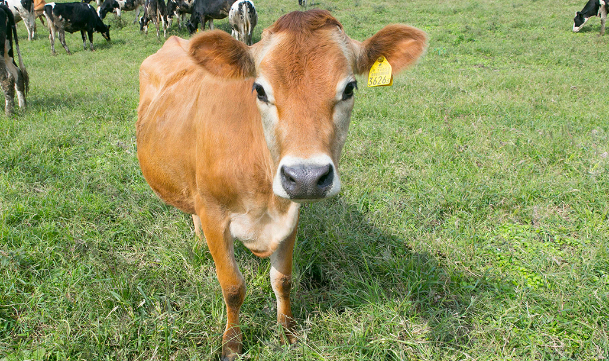
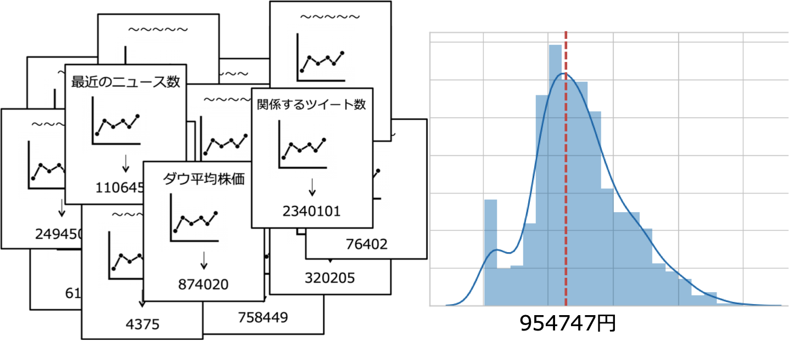
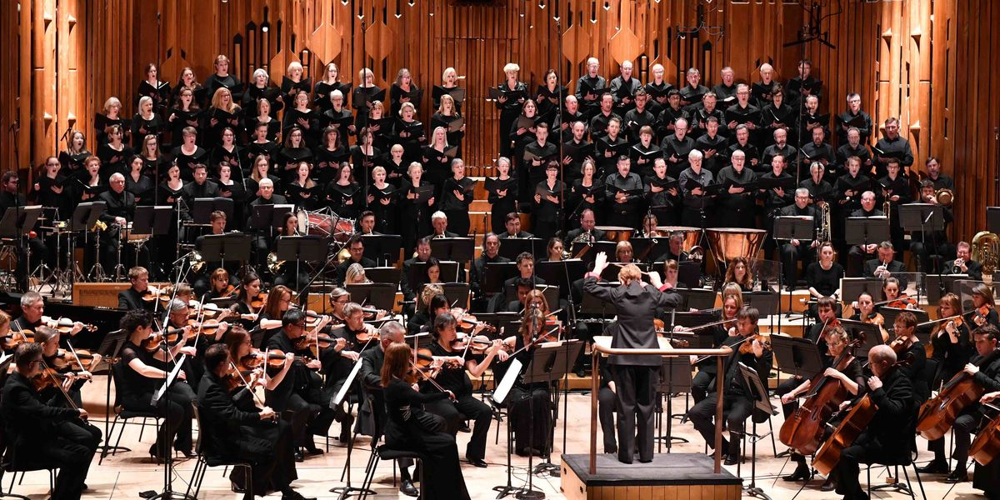
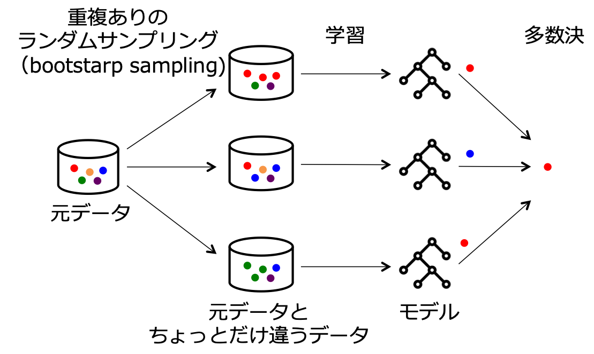
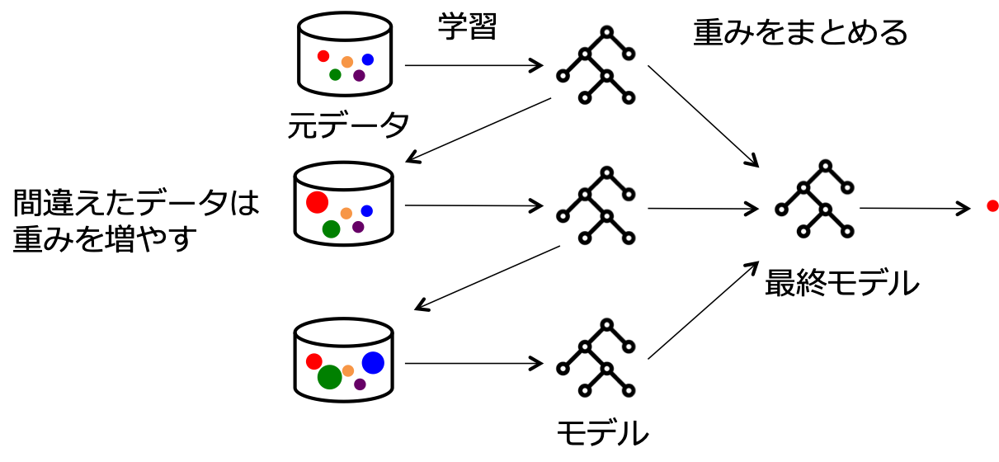
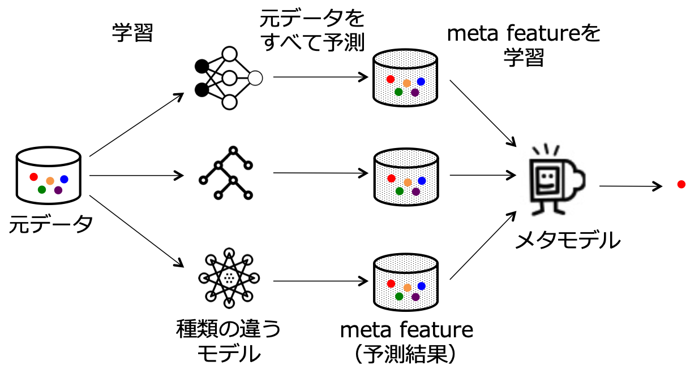
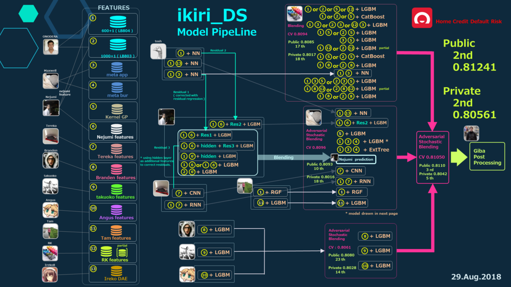

<!-- page_number: true -->

# アンサンブル学習でBitcoinの価格を予測する
# 〜なぜ集団は賢いのか？編〜

---


# ３人寄れば文殊の知恵


---

# 意味
>《「文殊」は知恵をつかさどる菩薩》凡人でも三人集まって相談すれば、すばらしい知恵が出るものだということ。

---

# １人より３人のほうが賢い

---

# 雄牛の重量当てコンテスト



---

# 雄牛の重量当てコンテスト

- 概要
  - 1906年イギリス
  - 参加者は6ペンスを払い、重量を予想して紙に書いて投票
  - 実際の重量と一番近い人が賞を受け取る
  - 787人が参加
- 結果
  - 実際の重量は1198ポンド
  - 参加者全員の平均は1197ポンド（誤差1ポンド）
  - 正確に当てた人はいなかった

---

# １人より７８７人のほうが賢い

---

# なぜ、集団のほうが賢いか？

---

# 答え：集団には多様性があるから

（多様性のない集団は賢くない）

---

# 数学的な根拠

```
集団誤差 ＝ 個人の推定誤差の平均 − 推定値のバラツキ
（バラツキが0のとき、1人の推定と同じ）
```
- 集団誤差を小さくするには
  - 各々の推定誤差を小さくする（当たり前）
  - ==各々の推定値がとてもバラバラ==

---

# 推定値をとてもバラバラにするためには？

```
◯：一人ひとりが、自分の考えで判断する
✕：他人の考えになびく
```

たとえば、

- ◯「この牛はよく肥えているから、平均より1割くらい重い」
- ◯「こいつの方が俺より10倍くらい重そうだな」
- ✕「専門家が1300ポンドって言ってるし、そのくらいだろう」

---

# 千野、ひらめく

独立の情報源からBitcoinの価格を推定するプログラムを大量に作れば、文殊の知恵効果でハチャメチャな精度が出るのでは！？


---

# どう実装するかを調べて、たどり着いた

---

# アンサンブル学習



---

# アンサンブル学習（Ensemble learning）

複数のモデルを組み合わせて予測精度を改善する手法
精度が改善する仕組みは、大別して３つ

1. バギング（Bagging）
2. ブースティング（Boosting）
3. スタッキング（Stacking）

---

# 1.バギング（Bagging）

多様性を与えたデータを並列に学習する手法
有名なアルゴリズム：Random forest



---

# 2.ブースティング（Boosting）

間違えたデータを正解に近づくように反復して学習する手法
有名なアルゴリズム：AdaBoost、LightGBM、他たくさん




---

# 3.スタッキング（Stacking）

元データをすべて予測した結果をさらに学習する手法
任意性が高く黒魔術らしい



---

# おまけ：Kaggleにおけるスタッキング

チーム内で分担してモデルを作成してスタッキング



---

# まとめ

- 集団が賢いのは、他人の考えになびかず、一人ひとりが自分の考えで判断しているから
- 同様に、機械学習でもアンサンブル学習を使うと精度を改善できる

---

# 次回予告

アンサンブル学習でBitcoinの価格を予測する
〜とりあえず実装してみた編〜

---

# 参考
- [集合知を将来予測に活用する社内予測市場 | 川崎リサーチライフ](https://kawasaki-research.net/?p=1428)
- [野中郁次郎　ナレッジ・フォーラム講義録 - Google ブックス](https://books.google.co.jp/books?id=amdgDwAAQBAJ&pg=PT101&lpg=PT101&dq=%E9%9B%86%E5%9B%A3%E8%AA%A4%E5%B7%AE+%E5%B9%B3%E5%9D%87%E5%80%8B%E4%BA%BA%E8%AA%A4%E5%B7%AE%E3%80%80%E9%9B%84%E7%89%9B&source=bl&ots=WJd_YJdNMa&sig=ACfU3U3l4fznI7dQhTUBns1L3hbxgp7meQ&hl=ja&sa=X&ved=2ahUKEwj_z7eu_b3iAhVPG6YKHelnCdwQ6AEwAHoECAkQAQ#v=onepage&q=%E9%9B%86%E5%9B%A3%E8%AA%A4%E5%B7%AE%20%E5%B9%B3%E5%9D%87%E5%80%8B%E4%BA%BA%E8%AA%A4%E5%B7%AE%E3%80%80%E9%9B%84%E7%89%9B&f=false)
- [【機械学習】OOB (Out-Of-Bag) とその比率 - Qiita](https://qiita.com/kenmatsu4/items/1152d6e5634921d9246e)
- [Bagging: Machine Learning through visuals. #1: What is “Bagging” ensemble learning?](https://medium.com/machine-learning-through-visuals/machine-learning-through-visuals-part-1-what-is-bagging-ensemble-learning-432059568cc8)
- [ブースティング入門](https://www.slideshare.net/Retrieva_jp/ss-80724064)
- [アンサンブル学習について勉強したのでまとめました：Bagging / Boosting / Stacking - St_Hakky’s blog](https://www.st-hakky-blog.com/entry/2017/07/28/214518)
- [ブースティングとアダブースト（AdaBoost）について詳しく解説 - 具体例で学ぶ数学](https://mathwords.net/adaboost)
- [Boosting, Bagging, and Stacking — Ensemble Methods with sklearn and mlens](https://medium.com/@rrfd/boosting-bagging-and-stacking-ensemble-methods-with-sklearn-and-mlens-a455c0c982de)
- [Ensemble methods: bagging, boosting and stacking – Towards Data Science](https://towardsdatascience.com/ensemble-methods-bagging-boosting-and-stacking-c9214a10a205)
- [Stacked Generalizationで分類器のスコアをひねり出す - Qiita](https://qiita.com/sergeant-wizard/items/d1509f71943b429929cf)
- [Kaggle Ensembling Guide | MLWave](https://mlwave.com/kaggle-ensembling-guide/)
- [A Kaggler’s Guide to Model Stacking in Practice | No Free Hunch](http://blog.kaggle.com/2016/12/27/a-kagglers-guide-to-model-stacking-in-practice/)

